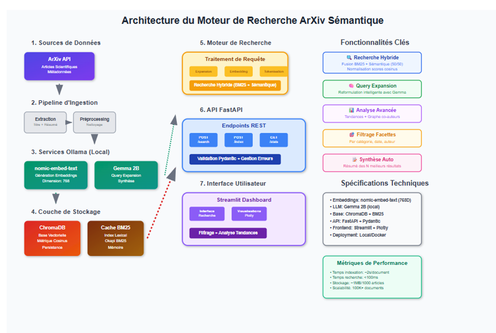

# PROJET_NLP_DIT

**Objectif**  
Mettre en œuvre un moteur de recherche local pour un corpus d’articles scientifiques (arXiv), doté de capacités d’interrogation **sémantique**, de **filtrage** et de **synthèse**.

---

## Concepts clés

- **Base de données vectorielle (ChromaDB)** : stockage de vecteurs (embeddings) générés via Ollama.  
- **Recherche hybride** : fusion des scores sémantiques (embeddings) et lexicaux (BM25).  
- **Query Expansion** : reformulation ou extension de requêtes à l’aide de Gemma (via Ollama).  
- **Recherche à facettes** : filtrage avancé des résultats selon les métadonnées (auteur, date, domaine…).

---

## Fonctionnalités attendues

1. Pipeline d’ingestion et d’indexation : segmentation, génération d’embeddings, indexation dans ChromaDB.  
2. Moteur d'interrogation avancé : expansion de requête, fusion hybride des scores.  
3. Interface web avec **Streamlit** : saisie de requêtes, affichage des résultats, filtres dynamiques, résumé automatique.  
4. Synthèse de résultats : résumer automatiquement les N meilleurs résultats avec Gemma.  
5. Analyse de tendances : visualisation temporelle des mots-clés dans le corpus.  
6. Graphe de co-auteurs : affichage des collaborations entre auteurs via un réseau.

---

## Détails techniques

### 1. Base de données vectorielle (ChromaDB)  
On stocke des **embeddings** générés par Ollama, permettant une recherche sémantique efficace.

### 2. Recherche hybride  
- **Sémantique** : recherche par similarité vectorielle.  
- **Lexicale** : recherche via BM25.  
- **Fusion des scores** : amélioration du classement final en combinant les deux approches.

### 3. Expansion de requête  
Gemma enrichit ou reformule les requêtes trop courtes ou ambiguës pour améliorer la pertinence des résultats.

### 4. Recherche à facettes  
Permet à l’utilisateur de filtrer les résultats par **auteur**, **date**, **catégorie**, etc.

### 5. Pipeline d’ingestion  
Extraction, segmentation des articles, génération d’embeddings, et stockage dans ChromaDB.

### 6. Interface web (Streamlit)  
Permet la saisie de requêtes, l’affichage interactif des résultats, l’application de filtres et la génération de résumés.

### 7. Analyse & visualisations  
- **Tendances** : évolution temporelle des mots-clés.  
- **Réseau d’auteurs** : visualisation des collaborations au sein du corpus.

---

## Aperçu de l 'architecture

## comment lancer le projet 
-**Install les dependences du fichier** : requirements.txt  
-**lancer le backend**  : python backend.py  
-**lancer le frontend** : streamlit run frontend.py 

---

## Licence

Ce projet est distribué sous la licence **MIT License** – voir le fichier `LICENSE` pour plus de détails.
